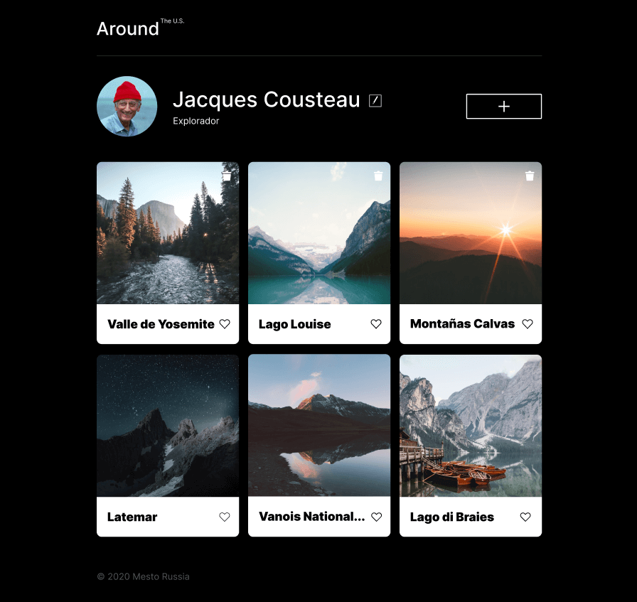

# Tripleten web_project_around

# Proyecto realizado en el bootcamp de desarrollo web de Tripleten. Utiliza HTML, CSS, JS y Webpack, y se desarrolló en Visual Studio Code.

## ¿De qué se trata?

### Se creó una página interactiva similar a una red social donde los usuarios pueden añadir, eliminar y dar like a fotos, así como editar su nombre de usuario e información personal a través de una API.

## El proyecto se adapta en las siguientes resoluciones:

1. 1280px Desktop

2. 800px Tablet

3. 320px Mobile

## Previsualización del Proyecto:

## Aprendizaje:

### Este es mi primer proyecto utilizando JS, donde empleé programación orientada a objetos (POO), asincronía y conexión a una API. Se utilizó Webpack para el empaquetado y se realizaron múltiples refactorizaciones para implementar clases y prácticas avanzadas de JS.

## Detalles del código:

### Este proyecto incorpora funciones para cargar imágenes y datos de usuario mediante la API apiTriple. Se utilizan clases como Card, Section, y UserInfo para gestionar la lógica de la interfaz. Las tarjetas se generan dinámicamente y se habilitan interacciones como likes y eliminaciones con confirmación. Además, se implementan validaciones en los formularios para asegurar la correcta entrada de datos.

## Link de Github pages para visualizar mi página: https://luis-gn006.github.io/web_project_around/index.html

# © Luis González

# Espero que disfruten de este proyecto tanto como disfrute haciéndolo. ¡Saludos!
