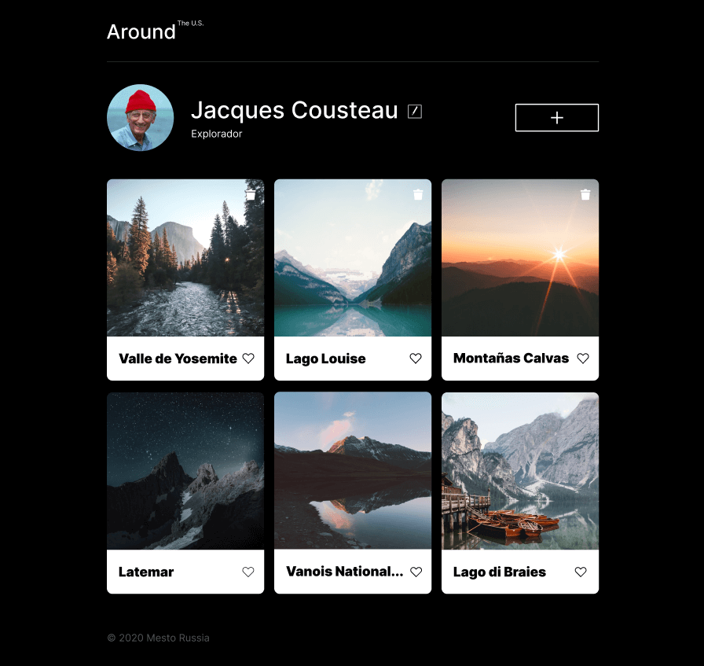

# Tripleten web_project_around

# Proyecto realizado en el bootcamp de desarrollo web de Tripleten. Realizado con HTML , CSS y JS. El proyecto fue realizado en VSS (Visual Studio Code)

## De que trata?

### Se realizó una página interactiva con semejanza a una red social, el usuario podrá añadir, eliminar o dar like a las fotos , al igual que editar su nombre de usuario e informacion acerca de si mismo.

## El proyecto se adapta en las siguientes resoluciones:

1. 1280px Desktop

2. 800px Tablet

3. 320px Mobile

## Preview del Proyecto:

## Aprendizaje:

### Este es mi primer proyecto en el que se implementará Javascript, como muestra de ello se va a programar una ventana modal con formularios de información del usuario. Lo más importante de esto, es que los datos guardados si se reflejen en la página.

## Link de Github pages para visualizar mi pagina: https://luis-gn006.github.io/web_project_around/index.html

# © Luis Gonzalez

# Saludos!
